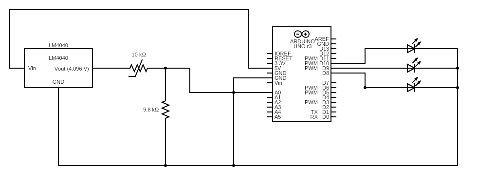

# Thermometer

The following repository contains my homemade thermometer project.

## Purpose & Function

This thermometer was made for the Science Olympiad event Detector Building. This repo contains code that finds the temperature of the thermometer probe and calibrates the thermometer to a reference thermometer. A picture of the electrical circuit can be found below.

## Parts Used

 - Arduino Uno
 - NTC Thermistor (MF52-103)
 - Resistor (9.8 kOhm)
 - Voltage Reference (LM4040)
 - Heat Shrink Tube
 - Silicon Adhesive
 - Breadboard
 - Lots of Jumper Wires
 
 ## Circuit Breakdown

The circuit can be broken down into two parts

 #### Voltage Dividor
 
 The 5V output from the Arduino goes into a 4.096 VRef, which then goes into a voltage divider circuit containing the NTC thermistor and 9.8k Ohm resistor. A wire that reads the voltage across the thermistor is located between the two resistors and connects to an Arduino digital input port. 
  
 #### LED

 Digital output pins power a certain LEDs depending on the calculated temperature.
 
 ## Code Breakdown
 
 #### Calibrate
 
 The code in this file 

